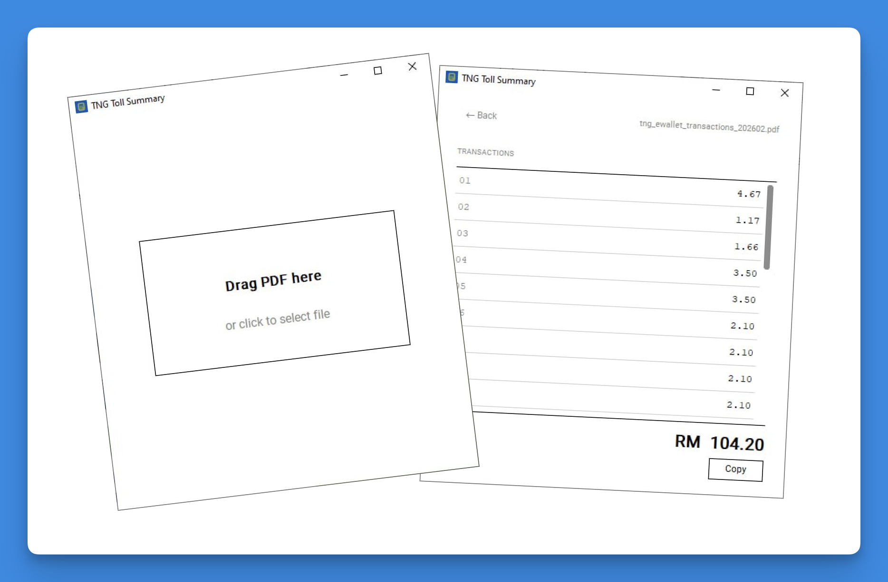

# TNG RFID 过路费汇总工具

一款简单的 Windows 应用程序，读取您的 TNG 电子钱包 RFID 过路费交易 PDF，一键生成总金额 —— 直接复制粘贴到报销单即可。



---

## 痛点

**员工提交报销时：**
每个月报销过路费，都要打开 TNG 电子钱包 PDF，一页一页翻，一笔一笔手动相加，生怕漏掉哪一条。PDF 跨越多页，每笔交易单独列出，没有任何小计。少算一笔或手误，整张报销单就错了。

**HR 审核报销时：**
同事提交 TNG RFID 过路费报销后，HR 还要打开同一份 PDF，逐笔核对金额是否正确。每人每月动辄 20–30 笔以上，多位同事同时提交，意味着要重复点算每一行、核对总额、找出差异 —— 全靠人工。费时费力，而且极容易出错。

这款工具同时解决两边的问题：员工几秒内得到准确总额，HR 也能即时核对一个清晰的数字。

---

## 使用说明

### 第一步 — 下载应用程序

1. 点击本页面顶部的 [**Actions**](../../actions) 选项卡
2. 点击最新一次带绿色勾选标记 ✅ 的运行记录
3. 向下滚动至 **Artifacts**，下载 **`tng_toll_summary-windows`**
4. 解压缩下载的文件，即可得到 **`tng_toll_summary.exe`**

> 无需安装任何软件，下载后直接运行。

---

### 第二步 — 导出 TNG PDF

1. 在手机上打开 **TNG 电子钱包** 应用
2. 点击 **交易记录** → **最近交易**
3. 点击右上角的**筛选图标**，选择 RFID
4. 选择您的车牌号码
5. 选择日期范围（例如当月报销期间）
6. 点击**发送至电子邮件**，PDF 将发送至您的邮箱
7. 查收邮件并下载 PDF

---

### 第三步 — 运行应用程序

双击 **`tng_toll_summary.exe`** 打开程序。

界面如上方截图所示。

**方式 A — 拖放文件**
从文件资源管理器将 PDF 文件拖放到应用程序窗口中。

**方式 B — 点击选择**
点击虚线框内的任意位置，然后选择您的 PDF 文件。

---

### 第四步 — 复制总金额

程序读取 PDF 需要 2–5 秒，完成后将显示：

- 每笔成功的 RFID 过路费交易明细列表
- 底部的**总金额**

点击总金额旁边的**复制**按钮，然后直接粘贴到报销单即可。

---

## 常见问题

**程序提示找不到交易记录。**
请确认 PDF 是从 TNG 电子钱包导出的交易记录，而不是截图或银行对账单。

**总金额看起来不对。**
程序只统计状态为 **Success（成功）** 的 RFID 过路费交易。待处理、失败或非过路费的交易不计入总额。

**杀毒软件报警。**
该 `.exe` 文件由 GitHub Actions 从本仓库源代码自动构建。这是 PyInstaller 打包程序的常见误报。您可以在此查看源代码，或自行构建。

**我使用的是 Mac 或 Linux。**
`.exe` 仅支持 Windows。Mac/Linux 用户可直接运行脚本，详见下方[从源码构建](#从源码构建)。

---

## 从源码构建

需要 Python 3.11+、[uv](https://github.com/astral-sh/uv) 以及 Tesseract OCR。

```bash
git clone https://github.com/your-username/tng-toll-summary
cd tng-toll-summary
uv sync
uv run python gui.py
```

推送到 `main` 分支后，GitHub Actions 会自动构建 Windows `.exe`。

---

## 技术栈

- [PyMuPDF](https://pymupdf.readthedocs.io/) — PDF 解析及内置 OCR 支持
- [Tesseract OCR](https://github.com/tesseract-ocr/tesseract) — 识别 PDF 中的图片页面
- [customtkinter](https://github.com/TomSchimansky/CustomTkinter) — GUI 框架
- [PyInstaller](https://pyinstaller.org/) — 打包为单一 `.exe` 文件
- [GitHub Actions](https://github.com/features/actions) — 云端自动构建 Windows `.exe`
- [uv](https://github.com/astral-sh/uv) — Python 包管理器

---

## 许可证

[MIT](LICENSE)
